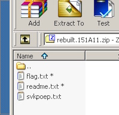
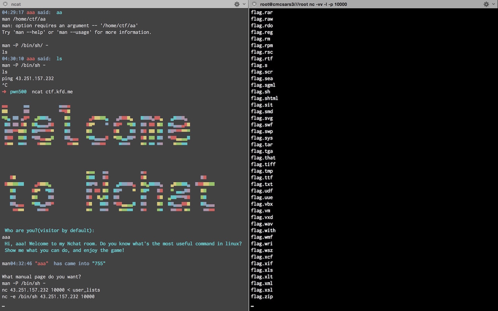

# MISC100

直接扔给 [Braintools](https://github.com/mbikovitsky/BrainTools)。然而居然是 VS 项目只能直接下载预编译的了。

# MISC200

大杂烩型文件，跑 binwalk。于是看到了更可怕的大杂烩……看到有加密的 zip，用 `binwalk xxx -e -y zip` 把文件分离出来。

分离出来的 zip 文件各种畸形，按照 hint 使用 WinRAR 修复后里面包括了加密的 `flag.txt` 和 `readme.txt`。还有一个没有卵用的文件可以直接删掉。

然而还有一个没被加密的 `readme.txt`，比较后发现大小一致可以 known plaintext attack。直接跑 ARCHPR 几十秒就跑出来了。

（然而我使用的是试用版 ARCHPR 只能解出压缩包中的第一个文件，还好 `flag.txt` 比 `readme.txt` 字典序要小）

# MISC500（虽然没做出）

屌炸天题，各种杂糅。

题目给出了一个 ncat 的聊天室。登录后会提示「do you know the most useful command in Linux」

研究半天后无果，机智的 w3b0rz 表示卧槽这是 man 啊。果然 man 可以用，然而这个 man 的行为非常诡异，经常报一些没什么卵用的错误。研究后发现可以用这个 man 来读取任意文件（但是 man 会试图进行排版，于是格式错乱 + 内容缺损）

尝试了 `/etc/shadow` 和 `/etc/passwd`。发现除了一个 `ctf` 帐号以外还有一个名叫 `neighbor-old-wang` 的非常恶趣味的帐号。

接下来我们尝试找到 ncat 聊天室程序的源码。首先想到的是利用 `/proc/self/cmdline` 然而这样获得的结果是 `man`。说明我们还是要学习一个。查了下资料发现 `/proc/self/stat` 里的第四项就是父进程的 pid 简直好评如潮。于是通过查询父进程的 `cmdline` 找到了 ncat 聊天室源码的位置在 `/home/ctf/nc_test.sh`。

果断 `man /home/ctf/nc_test.sh` 后发现它被 man 排版成了巨大的一坨翔。而且很多关键部分都没能显示出来。

经过艰苦的阅读，连猜带蒙地发现可以用 `man -P command arg` 来运行一个进程。而且它还特么的一定要有一个参数简直是日了 poi。然而这个方式运行的进程不知道有什么毛病，试图执行 cat、python、bash 啥的都直接没有回显然后进程似乎就挂了，依旧可以发送信息但是不会有任何回显；执行 ls 之类的反倒是有用。于是结合使用 ls 看到的东西读取了一下 home directory 下的一些可疑文件。

（这张截图事实上执行的并不是 ls 命令。由于聊天室程序的 bug 或是 feature 它有时候会返回之前执行的命令的输出，这句 `ls -la` 其实是我之前执行的，挂了无回显）

这里有一个技巧是 home directory 下可以看见 vim 的历史 `.swp` 和 `.viminfo`，里面有查看 `~/flag?/.flag` 和 `~/flag?/flag.php` 的内容。后者为嘲讽，前者是用 classical cipher 加密的一段话，告诉我们 flag 在隔壁老王那里。

此时 w3b0rz 的智商再次成功爆表，在跑了 `man -P bash -` 后直接 ping 自己的服务器。此时没有任何回显然而自己的服务器接收到了 ping。。卧槽原来它只是回显挂了而已啊。于是定番的 nc 反向弹 shell + 拿 tty。之后发现那台机器的 22 端口开着的于是我们把自己加到了 ctf 用户的 authorized_keys 里然后直接 ssh 了上去。。

接下来就是使用 John the Ripper 暴力猜解隔壁老王的密码，结果是 666666。补充一句，这里是用 JTR 三步走中的第二步破解出来的，不过 password.lst 文件需要用 locate 去找。具体教程可移步 docs/John_the_Ripper.md

su 进去后看到了 flag.txt，我吼兴奋啊我吼兴奋啊。

出题人就问你服不服。（顺带一提之后这个文件被人修改成了一个假的 flag 真是丧心病狂）

于是惯例查了一下老王的 .bash_history，发现了出题人留下的良心（？）提示。。

和前面的比太良心了有没有！然并卵因为打开以后是……

所以说我们还是图样图森破，丧太母拿衣。出题也要按照基本法啊怎么能这样。。试图访问那个 json 它只是返回了 `uname -a` 的结果。。于是我们就死在这里了。。。

事实证明这个地方是 Shellshock。`cgi-bin` 这部分就是为了提示这个。。心累。。